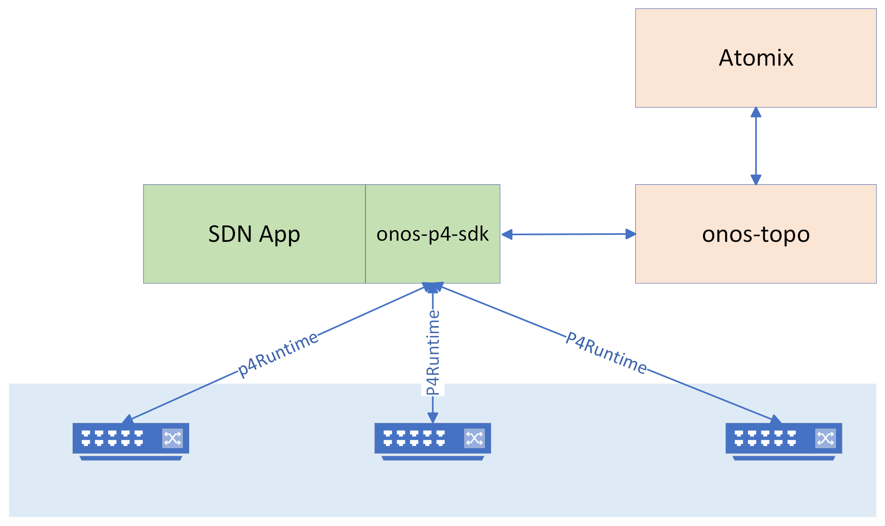

<!--
SPDX-FileCopyrightText: 2022 Intel Corporation

SPDX-License-Identifier: Apache-2.0
-->

# onos-p4-sdk
This project implements a local [P4Runtime](https://github.com/p4lang/p4runtime) controller that provides minimum required 
functionality for implementing SDN applications in Golang. Furthermore, the controller provides an [interface](https://github.com/onosproject/onos-p4-sdk/blob/master/pkg/p4rt/sdk.go) 
that can be used by applications to interact with P4 programmable devices. 

## Architecture 
The following figure shows the interaction of an SDN application with other micro-onos subsystems such as
[onos-topo][onos-topo] and [Atomix][Atomix]. onos-topo subsystem
used to model control plane and data plane entities and their relations. 

The details about core functionality of SDK and its interactions with other 
subsystems are explained in [Core Packages](docs/core_functions.md) document. 

## Getting Started

[onos-topo]: https://github.com/onosproject/onos-topo
[Atomix]: https://github.com/atomix

